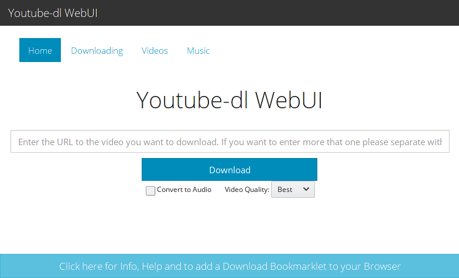
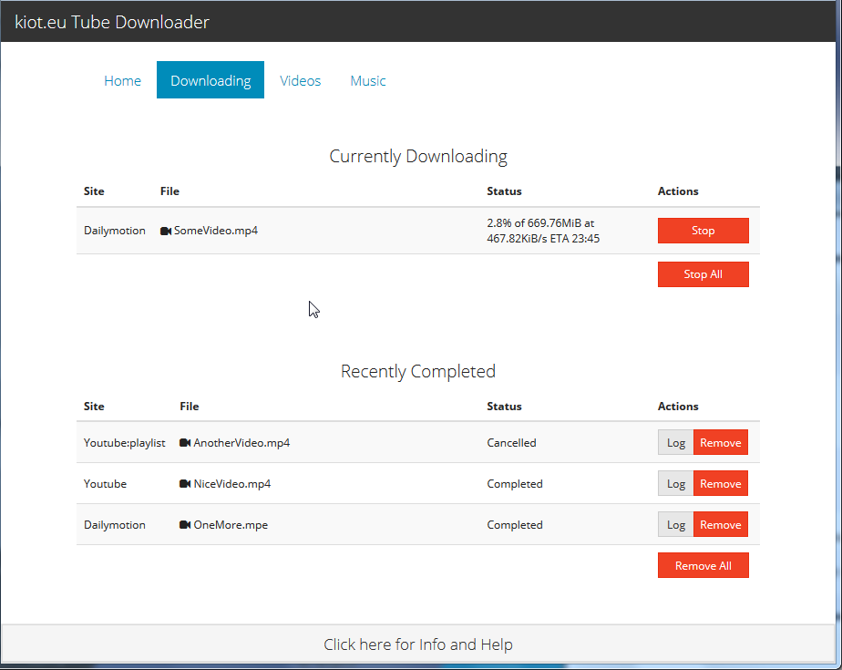

# Youtube-dl WebUI

## Description
Youtube-dl WebUI is a small web interface for youtube-dl. It allows you to host your own video downloader. 
After the download you can stream your videos from your web browser or save them on your computer directly from the list page.
It supports simultaneous downloads in the background.

## Changes from original
- UI redesign
- Download status is displayed
- Cancel individual jobs
- View download log (optional)
- Bookmarklet to open downloader with URL already filled in (the bookmarklets can be found in the Info and Help section - click the bar at the bottom of the webpage)
- Show completed and cancelled downloads
- Audio format can be selected
- Video quality can be selected (currently only best and smallest)
- File deletion confirmation dialog
- Add more config options
- Removed authentication option
- Theme can be changed in config.php
- Default theme is Yeti
- Add --ignore-error to the youtube-dl command line so that the download of a playlist doesn't stop if one video can't be retrieved

## Requirements
- A web server (Apache or nginx)
- PHP latest version should be fine.
- Python 2.7 for Youtube-dl
- [Youtube-dl](https://github.com/rg3/youtube-dl)
- avconv or other is required for audio extraction (from youtube-dl doc) :
`-x, --extract-audio convert video files to audio-only files (requires ffmpeg or avconv and ffprobe or avprobe)`

## How to install ?
1. Clone this repo in your web folder (e.g.: /var/www).
2. Rename config/config.sample.php to config/config.php
3. Edit config/config.php to your liking
3. Create the download folder. 
4. Check permissions.
5. Load index.php to check that everything works.

## CSS Theme
[Bootswatch](https://bootswatch.com/)

## License

Copyright (c) 2017 Uli Koeth

Permission is hereby granted, free of charge, to any person obtaining a copy
of this software and associated documentation files (the "Software"), to deal
in the Software without restriction, including without limitation the rights
to use, copy, modify, merge, publish, distribute, sublicense, and/or sell
copies of the Software, and to permit persons to whom the Software is
furnished to do so, subject to the following conditions:

The above copyright notice and this permission notice shall be included in all
copies or substantial portions of the Software.

THE SOFTWARE IS PROVIDED "AS IS", WITHOUT WARRANTY OF ANY KIND, EXPRESS OR
IMPLIED, INCLUDING BUT NOT LIMITED TO THE WARRANTIES OF MERCHANTABILITY,
FITNESS FOR A PARTICULAR PURPOSE AND NONINFRINGEMENT. IN NO EVENT SHALL THE
AUTHORS OR COPYRIGHT HOLDERS BE LIABLE FOR ANY CLAIM, DAMAGES OR OTHER
LIABILITY, WHETHER IN AN ACTION OF CONTRACT, TORT OR OTHERWISE, ARISING FROM,
OUT OF OR IN CONNECTION WITH THE SOFTWARE OR THE USE OR OTHER DEALINGS IN THE
SOFTWARE.
